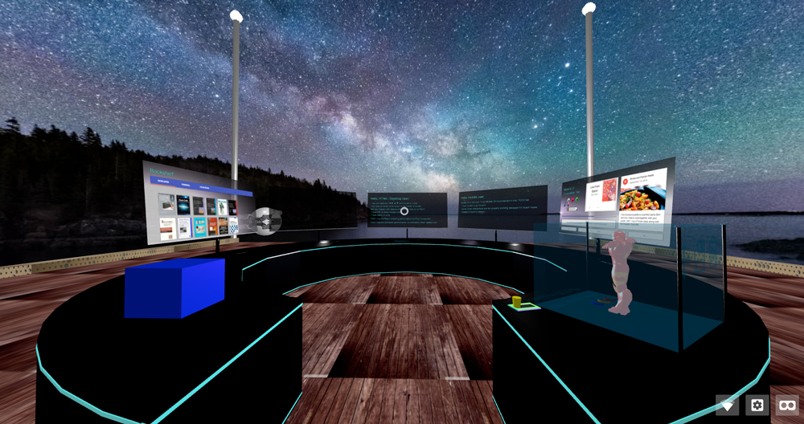

### Introduction
I took a look at Aframe and said wow about it features.

But a question was raised in my mind: **"So what is VR can do right now? Is it suitable for widely production/commerce use?"**

After took a quick research about: ReactVR, Aframe, Three.js, elevr ...

I chose Aframe to make a VR workspace.

Aframe has large amount of demos, its syntax is something look like html, jsx, very familiar.



### What were the differences between this demo and another one?
Another demos was so great, each demo stand for 1 feature that was very easy to learn.

My demo look like a final VR product (my VR workspace), introduce a React Aframe Assets Management System ([Why `RAAMS`?](https://github.com/luatnd/aframe-react-demo#assets-manager-for-react-with-aframe))

So it might help you go straight into your work or it might be one of your reference resources.

### Which Aframe's features were demonstrated in this demo

* React Asset Management System (RAMS) —> Specify your asset at your component and then `RAMS` automatically collect this asset into single <a-assets/>
* Lightning in AFrame
* 360deg image sky
* Basic physical handling: User can not go through the wall or any physical object, user can jump
* Basic physical handling for: Floor and wall is box and plane with texture
* Physical system handling with complex shape, like the center circular table in this case. 
* Custom camera (player) distance to the static-body shape
* Loading 3D model: gltf, Collada, obj, exported from Blender
* Basic loop animation, no timeline.
* Player cursor interact with some object
* Dialog notification
* Display HTML content (by Material UI) into VR scene

TODO: 
* Implement lazy-load for some heavily model --> Not sure about how Aframe handle the 12MB Drone166 3D models in my demo
* Optimize UX on mobile device


### Libraries 
* VR library by `AFrame`, base on `Threejs`
* 3D model was created by `Blender`, and some free model on internet (see [Credits](https://github.com/luatnd/aframe-react-demo#credits) section)
* `React`
* State management with `Redux`
* Typesafe coding with some `Typescript` language, and `ES6`
* Code quality with `ESLint` ~~+ TSLint~~
* ~~UnitTest by JEST~~
* WebUI by `Material-UI` (customized to glassy feeling theme)
* CSS in JS by `JSS`
* Some of libraries for `Aframe` (see [Credits](https://github.com/luatnd/aframe-react-demo#credits) section)

### Warning
This is a quick demo, so the code somewhere are not refactored and optimized, be careful and read the Aframe's official documentation once again before you use it in your production 


### Installation

To get started development:

```bash
yarn install
yarn start
```

To publish to GitHub Pages:

```bash
npm run publish
```

## Develop
### Assets manager for React with Aframe
> NOTE: Use [aframe-react-assets](https://www.npmjs.com/package/aframe-react-assets) instead.


## The aframe-react-boilerplate
This boilerplate was created from `aframe-react-boilerplate`
It's a boilerplate for building virtual reality experiences with [A-Frame](https://aframe.io) and React with [aframe-react](https://github.com/ngokevin/aframe-react).

But for this project, you need to eject it and customize some webpack configurations.
If you need a full control, plz use create-react-app then do implement yourself.  


# TypeScript config:
To working with Three.js, you need to add the lib:
tsconfig.json
```
{
  "compilerOptions": {
    ...
    "lib": [ "es2015", "dom" ]
  },
  ...
}
```

# Webpack addition config:
To support decorator, you need to:

webpack.config.dev.js
```
  {
    ...
    loader: 'babel',
    query: {
      ...

      "presets": [ "react" ],
      "plugins": [
        "transform-decorators-legacy"
      ],

      ...
    }
  },
```

# Credits
Some of library and 3D models is from internet, thanks to awesome works of:

**// TODO: Update the credits list**

# Other:
A sense physicall system debugging is turned on by default (On Firefox / Safari.)
For Chrome, you need to temporary modify the: node_modules/aframe-physics-system/src/system/physics.js:25
 { default: false -> true },
 
 
 
# My opinion about Aframe in Vietnamese
```
P/s: Ý kiên chủ quan và có thể không đúng

AFrame 0.6.1
WebVR demo mặc dù chả có interaction nào đáng gọi là VR cả.

**Pros:**

Dễ, đối với ai từng làm web thì cú pháp chỉ nhìn là hiểu.
Sử dụng tag có dạng html + JS để code nên có thể tích hợp code bằng React, Redux, Typescript hoặc stack nào đó tùy sở thích.
Base trên Threejs nên nếu có kn về Three thì chuyển sang trong nửa nốt nhạc
Hỗ trợ khá nhiều định dạng model 3D căn bản như obj, dae, gtlf, fbx, …
Xử lý ánh sáng basic khá tốt, nhưng nên hạn chế nguồn sáng vì ảnh huởng tới performance khá nhiều.
Dĩ nhiên là WebVR thì hiện tại chưa thể mong đầy đủ hiệu ứng vật lý như trên native được, nhận thấy ở mức chấp nhận được. mà càng đầy đủ hiệu ứng thì càng nặng.

**Cons:**

Cộng đồng khá thưa, nhưng nếu hỏi trên Stackoverflow là lại có mấy ông thuộc cả tên lên trả lời hầu như ngay lập tức. và một số ít ông có kinh nghiệm Threejs (107,046 downloads in the last month)
Cảm giác cả repository to khụ trên github mà Mozilla để có vài ông contributor hoạt động active thôi.

Các thư viện quanh hệ sinh thái VR cho AFrame gọi là cho có, và đều focus vào mục tiêu nhỏ lẻ. Sử dụng cũng được.

Còn mới mẻ nên chưa hỗ trợ nhiều và đủ UX. 
Ví dụ trên mobile: Chưa hỗ trợ đi lại khi view VR trên mobile device, hiện mới có touch để di chuyển. Hoặc đôi khi muốn tắt VR dùng 4 nút di chuyển mà chưa thấy có support.
Xử lý physics chưa tốt: Ví dụ: Nếu “cố gắng” vẫn có thể đi xuyên qua tường được. Hoặc: Handle chống đi xuyên qua model có hình dạng phức tạp thì phải tự handle lấy

Performance: 1 scene căn bản gồm tầm <100 object chạy trên Galaxy S7E không thấy nóng, không giật. Đối với model 12MB thì có hiện tượng đơ 1s khi nạp model.

Animation very very basic và sử dụng tweenjs, support nghèo nàn và thiếu timeline, ai có kinh nghiệm thì port 1 thư viện animation khác sang để giải quyết, ví dụ anime.js

Chưa hỗ trợ Shadeless material (constant material), có lẽ do Threejs chưa hỗ trợ
Collada model vẫn chưa hỗ trợ transparent.

Có một cảm giác thiếu thiếu về nhu cầu UX khó nói thành lời trên mobile

**Chốt: **
Không biết các engine crossplatform như Unity hỗ trợ tới mức nào rồi, chưa có dịp thử qua các thư viện WebVR khác nhưng lướt qua thì vẫn thấy AFrame là đáng lựa chọn nhất. (Quan điểm chủ quan của cá nhân.)
```
